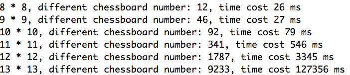
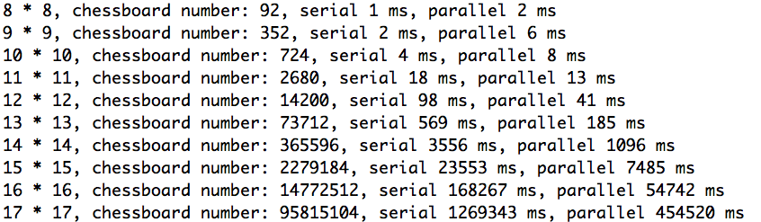

# EightQueens
Solve eight queens puzzle with parallel algorithm

## Requirements

Before building this project, make sure the following requirements are correctly installed in you running environment. It is recommended to install the lastest version.

* Java JDK >= 1.8.0
* Maven >= 3.3.0

## How to build

Clone a copy of the main repo by running:

> git clone https://github.com/MyXOF/EightQueens.git

Enter the EightQueens directory and run the build script:

> cd EightQueens/eight-queens

> ./package.sh

## Demo

### Eight queens puzzle

To display the solution of **Eight queens puzzle**, run

> ./eight-queens-demo.sh

You will see 12 different solutions.

### Different sulotion

To find out how many different solutions for a given N*N chessboard, run

> ./chessboard-diff.sh

### Compare the efficiency of serial and parallel execution

To display the efficiency differences between serial and parallel, run

> ./performance.sh

You will see the number of the solution of **N queens puzzle**(in this project, n ranges from 8 to 17) and time consumption by serial and parallel execution

## Documentation

See our [report](https://github.com/MyXOF/EightQueens/tree/master/doc).

## References

1. [Eight queens puzzle, Wikipedia](https://en.wikipedia.org/wiki/Eight_queens_puzzle)
2. https://oeis.org/A002562
3. https://oeis.org/A000170
